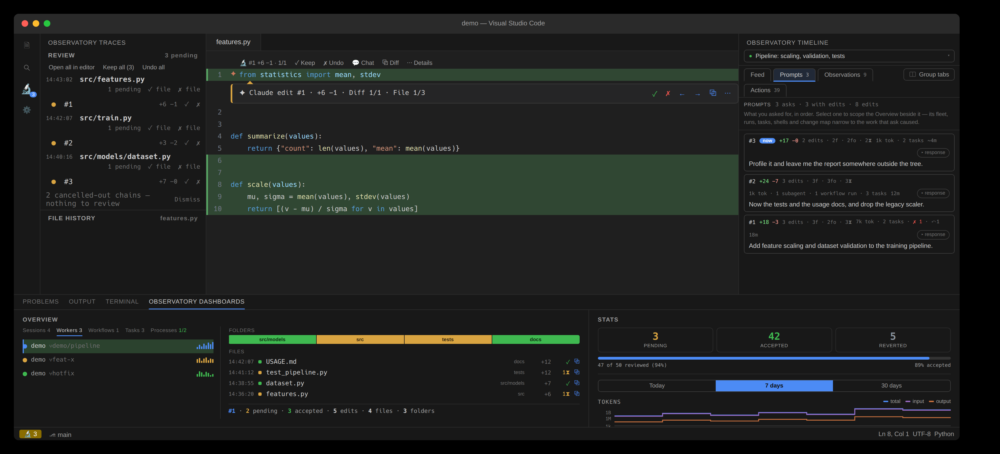
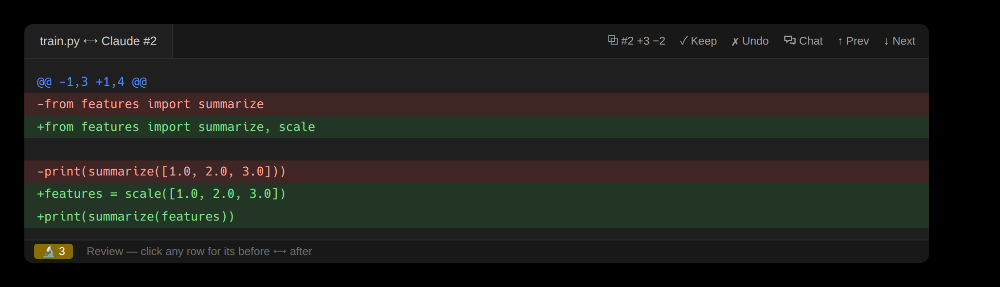
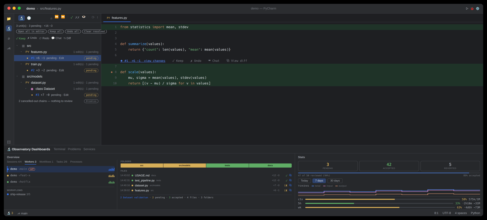
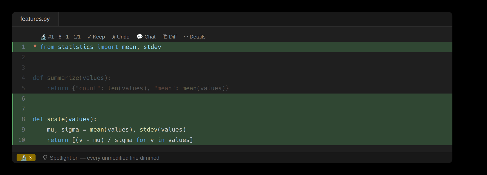
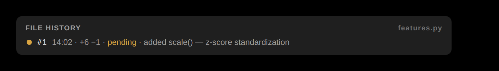
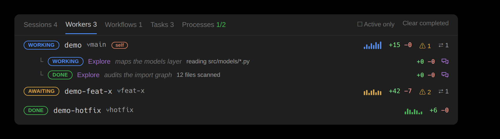
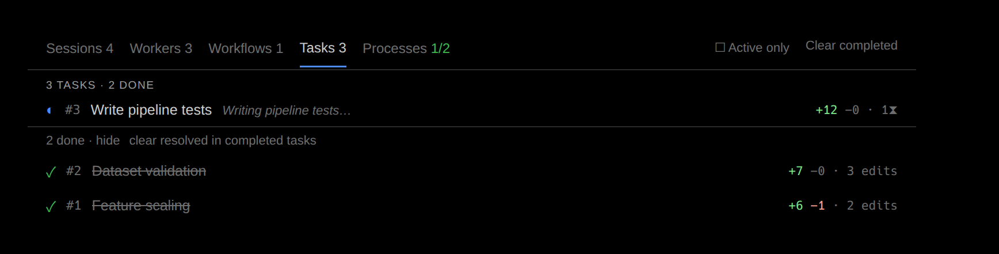
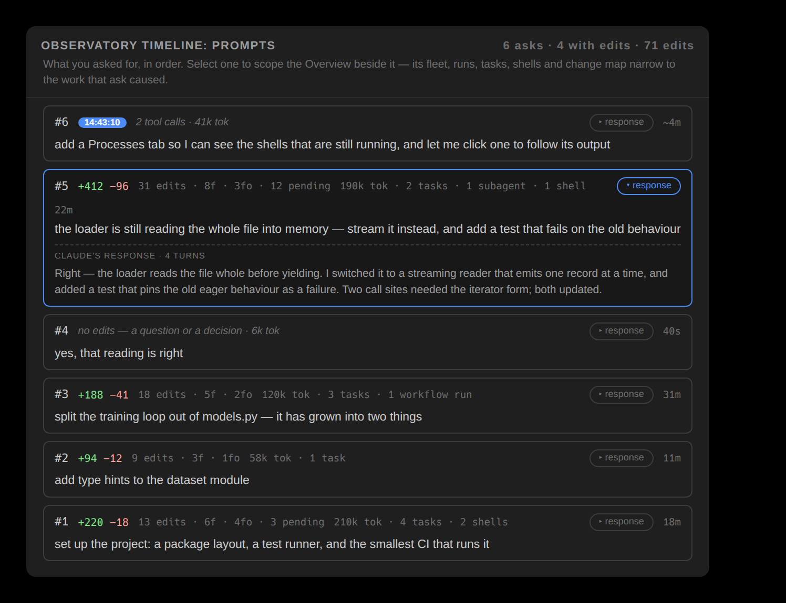
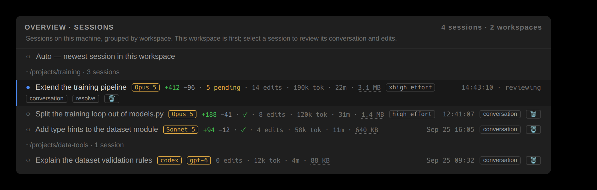

# OAK — feature walkthrough

This walkthrough uses the bundled demo simulator, which exercises the real capture and review
pipeline. Every `console` block below is the output of one `oak demo --fast` run in a git
repository at `/tmp/obs-demo/ws`, with `HOME` at `/tmp/obs-demo/home`, and every command ran from the
repository root. Sections 4 and 5 act on the session in the order shown; every other block shows
the session as the demo left it. The `text` blocks sketch editor surfaces and are illustrative. To
regenerate the output, run the same commands in a temporary configuration and workspace; never
publish output from a personal agent session.



> The **[visual showcase](https://cell-observatory.github.io/oak-observatory/showcase.html)** presents
> the same material in the browser (rendered from [showcase.html](showcase.html) via GitHub Pages).

## Zero-setup demo — try it without an agent

The **[interactive demo](https://cell-observatory.github.io/oak-observatory/showcase.html#demo)** replays the
scenario in the browser, with no editor and no agent session required. Locally, the built-in simulator
replays the same scripted session through the **real pipeline** — a genuine transcript, edits captured
by the same hooks, a subagent, a workflow run, and, inside a git repository, a second agent in a sibling
worktree — inside isolated `demo-…` sessions and an `observatory-demo/` folder it creates in the current
directory.

**In an editor**, run **Start Demo Mode** from the VS Code command palette or JetBrains Find Action, use
the buttons at the end of the Overview's nav bar, or click **Try the demo** in an empty panel — which works
before `oak init` has ever run, because the replay drives the capture pipeline directly. The
panels fill beat by beat, and the **guided tour** opens when the replay finishes.

**In the terminal:**

```bash
oak demo          # run it in an open workspace and watch every panel update live
oak demo --tour   # the guided tour's steps, as prose
```

Open the Overview while it runs: the **Tasks** tab works through six numbered tasks, the last still in progress when the replay ends (live statuses and
per-task edit counts), the Folders strip and the Files ledger fill in as each edit lands, the **Workers**
tab gains a second agent on `demo/hotfix` and flags the file both agents are holding, the **Workflows**
tab shows a three-phase run, and the **Processes** tab picks up three background shells — one that exits
0, one that fails, and one left running. Partway through, the scenario runs the context window out; the
compaction that follows is reported in the Actions timeline and in Stats. Click any row and the **feed** —
the Timeline’s Feed tab, which opens on the click, fills with that selection’s activity. Observations streams the reasoning throughout.
The scenario also fails a tool call, runs a command `risk` flags, deletes a file, writes a report outside
the workspace, reads a file outside it, fetches a URL and calls an MCP server, so every audit has
something real to report. The edits are real store records on real files, so Accept / Reject /
task-scoped review all genuinely work.

Starting the demo again **resets** it: a run clears any previous demo for that folder before replaying,
so a second run never stacks a stale, half-reviewed session beside the fresh one. The replay is
cancellable, and what a stopped run left behind is still real, reviewable and removable. To remove it:

```bash
oak demo --clean  # both sessions, their stores, the demo folder, and the scratch dir
```

or **Exit Demo Mode** in either editor. Reviewing the demo leaves no residue either way — a fully
reviewed demo session clears its own store. (`--speed 2` paces it faster; `--fast` lands everything at
once, which is what the test suite uses; `--no-fleet` leaves out the second agent.)

## The guided tour

The tour walks **forty-two steps** covering every panel the product ships and every named feature —
including revision navigation, Spotlight, search, the chat handoff, export, the status
bar, the Explorer badges, the Timeline's session selector, context sources and file memory. It lives in core, so the terminal and both
editors show the same steps: a step added to a panel reaches every editor at once, and none of them can
drift into its own wording.

It opens with a choice of **two tracks**: **Essentials** (14 steps — the review model, the agents, the
audits) or **Everything** (all 42). Finishing the short one offers the other 28 as its own track, in both
editors and in the terminal (`demo --tour --remainder`). The short track is a filter over the same list, in the same order, so
the two can never tell different stories. In the terminal, `demo --tour --essentials` prints the short one.

The tour **plays itself**: each step holds long enough to read it, and any control — Next, Back, a step
jump — hands you the wheel, with a transport button to resume. A **YOUR TURN** step shows a countdown and
performs the action itself if you do nothing, so watching it hands-off still shows Keep and Undo really
happening rather than only describing them.

It **docks beside your code**: an editor-area panel in VS Code, a tool window on the right in JetBrains.
VS Code can also **detach** it into a window of its own for a second screen, and remembers the choice.
JetBrains cannot — its floating window never appeared in PyCharm 2025.2, so it was removed rather than
shipped as a control that does nothing.

Each step brings its surface forward — the Overview tab, the sidebar tree, or the file itself — and
**rings** the control it names: a CSS outline in VS Code, a glass-pane painter in JetBrains. The step's
text stays in the tour window rather than being copied into the panel, so the panel keeps showing the
product and not a second narration of it. Neither editor lets an extension draw over IDE chrome it does
not own (the activity bar, the tab strip, the status bar), so for those the step's text names the control
instead. JetBrains rings some controls more coarsely than VS Code: four of the Overview's toolbar anchors
resolve to the toolbar row rather than the button, and the two token anchors in Stats both resolve to the
token strip. A step whose control this build cannot resolve rings nothing and still reads.

While the tour runs, the Overview's **Active only** filter is held open so the rows a step describes are
actually on screen — five of the demo's six tasks are completed, and the filter hides completed tasks by
default. Your own setting and your own tab come back when the tour ends.

Back, Next and a step chooser drive it (plus Dock/Float in VS Code); **Exit demo** ends it and removes
the session. In JetBrains, hiding the tour's tool window **pauses** it — a tour must never keep acting behind a
window you cannot see, and its wait steps accept and revert edits on a timer. Bringing the window back
restores the step's outline; resuming is yours to ask for, like every other control.

On a first install, and once after an update, both editors **offer the demo**: one notification, four
seconds after startup, carrying **Never ask**. It is skipped while an agent session is live in that
project, in a workspace you have not trusted, and once a demo is already recorded there — so it never
interrupts work, and never asks twice for the same version.
Closing the tour window ends the tour. Read the whole script at any time with
`oak demo --tour`.

## The demo session

The scenario is three of your asks, six numbered tasks — the last still under way when it ends — and **nine captured edits** across two agents:

| # | File | Tool | Prompt · task | Change |
| --- | --- | --- | --- | --- |
| 1 | `src/features.py` | Edit | 1 · scaling | add `scale()` — z-score standardization |
| 2 | `src/train.py` | Edit | 1 · scaling | scale the features before the model sees them |
| 3 | `src/features.py` | Edit | 1 · scaling | guard `scale()` after the sanity run **fails** |
| 4 | `src/models/dataset.py` | Edit | 1 · validation | add `Dataset.validate()` |
| 5 | `tests/test_pipeline.py` | Write | 2 · tests and docs | written by a **subagent** |
| 6 | `docs/USAGE.md` | Write | 2 · tests and docs | written by a **workflow** agent |
| 7 | `src/legacy_scaler.py` | Bash | 2 · retire the scaler | **deleted** — captured by the tree-diff path |
| 8 | `src/features.py` | Edit | 3 · profiling | add `profile()`, in a region of its own |
| 9 | `~/.claude/claude-observatory/.demo-scratch/…/profile-report.md` | Write | 3 · profiling | **outside the workspace** |

Edits 1 and 3 change the same code, so they collapse into one review unit; edit 8 does not, which is why
`src/features.py` ends up with two units you can accept independently. A tenth edit belongs to the second
agent: a hotfix to `src/features.py` that collides with this session's, held pending on both sides.

No extra tokens were spent capturing any of it — the hooks run outside the model loop. The transcript
gives the Observations panel its recap and each edit's reasoning, for free.

---

## 1 · Setup (once, with Claude Code closed)

```bash
./install.sh                              # or: npm run build && npm i -g --allow-scripts=node-pty ./packages/cli && oak doctor --fix
oak init --with-statusline # capture hooks + the bundled status line (usage bars)
```

> Install the hooks **before** launching Claude Code — a running session reverts hook edits made
> mid-session. Then launch Claude Code and let it edit; every session after that captures automatically.

Confirm it is live:

```console
$ oak status
capture hooks:   installed
hook script:     oak (on PATH) [ok]
oak server:      not running — starts with oak tui
codex hooks:     not installed (`oak init --codex` to capture codex sessions)
active session:  demo-ba9da914
store:           /tmp/obs-demo/home/.claude/claude-observatory/demo-ba9da914
last capture:    21:43:43
edits:           9  (9 pending · 0 kept · 0 undone)
```

(With codex on the machine the `codex hooks:` line reads `installed → ~/.codex/hooks.json  trusted` —
codex skips untrusted hooks silently, so the trust state is checked, not assumed.)

---

## 2 · List — the running log

Edits are grouped by file, newest ids last, with the line delta and status. A change the agent revised
lists once, under its latest edit: `#3` below also carries `#1`, the first version of `scale()`
that `#3` fixed, which is why `status` counts nine edits and the list eight:

```console
$ oak list
8 edit(s)  ·  8 pending  ·  session demo-ba9da914

observatory-demo/src/train.py
  #2  pending  +3 -2  Edit  21:43:43

observatory-demo/src/features.py
  #3  pending  +8 -1  Edit  21:43:43
  #8  pending  +8 -0  Edit  21:43:43

observatory-demo/src/models/dataset.py
  #4  pending  +7 -0  Edit  21:43:43

observatory-demo/tests/test_pipeline.py
  #5  pending  +12 -0  Write  21:43:43

observatory-demo/docs/USAGE.md
  #6  pending  +12 -0  Write  21:43:43

observatory-demo/src/legacy_scaler.py
  #7  pending  +0 -7  Bash  21:43:43

/tmp/obs-demo/home/.claude/claude-observatory/.demo-scratch/demo-ba9da914/profile-report.md
  #9  pending  +9 -0  Write  21:43:43

diff <id> · keep <id> · undo <id>
```


Filter with `--pending` / `--kept` / `--undone` or `--file <substr>`. `oak sessions`
lists this machine's sessions grouped by workspace, each led by its name (a `/rename`, else the agent's
own title) with its edits, tokens, duration, model and last activity; `●` marks the one that resolves
for your current directory:

```console
$ oak sessions

/tmp/obs-demo/ws · 1 session
● Pipeline: scaling, validation, tests  demo-ba9da914  8 edits · 9k tok · 0s · Opus 4.8 · 21:43:43

/tmp/obs-demo/ws/observatory-demo · 1 session
  Hotfix: clamp scale() so a constant column cannot divide by zer…  demo-6841aa10  1 edit · 435 tok · 0s · Opus 4.8 · 21:43:43

● = resolves for this workspace · sessions on this machine, grouped by workspace
use `--session <id>` to target another
```

## 3 · Diff — inspect one edit

```console
$ oak diff 2
Index: /tmp/obs-demo/ws/observatory-demo/src/train.py
===================================================================
--- /tmp/obs-demo/ws/observatory-demo/src/train.py
+++ /tmp/obs-demo/ws/observatory-demo/src/train.py
@@ -1,3 +1,4 @@
-from features import summarize
+from features import summarize, scale
 
-print(summarize([1.0, 2.0, 3.0]))
+features = scale([1.0, 2.0, 3.0])
+print(summarize(features))

keep #2 · undo #2
```



## 4 · Keep vs. Undo

**Keep** marks an edit reviewed — it never touches the file:

```console
$ oak keep 2
✓ kept edit #2 (observatory-demo/src/train.py)
```

**Undo** is surgical, and it refuses to corrupt. `undo <id>` reverts the whole change an edit belongs
to, while `--ids` takes edits one at a time — and reverting edit #1, the first version of `scale()`,
on its own would strand edit #3, the fix built on it, so you get a clear conflict instead:

```console
$ oak undo --ids 1
⚠ reverted 0 edit(s) in 1 selected edit(s) · 1 conflict(s) left (undo individually with --force)
  ↳ edit #1 overlaps a later change to features.py. Run `oak undo 1 --force` to restore the file to its pre-edit-#1 state, which drops later edits #3, #8 and anything else changed in the file since.
```


Undoing edit #8, though, peels just the `profile()` helper back out of `features.py` — `scale()`, its
fix and the rest of the file survive untouched (a **position-anchored 3-way line merge**, not a
whole-file rewind):

```console
$ oak undo 8
✓ undid edit #8 (/tmp/obs-demo/ws/observatory-demo/src/features.py)

$ oak redo 8
✓ re-applied edit #8 (/tmp/obs-demo/ws/observatory-demo/src/features.py)
```

**Redo** re-applies an undone edit; `--force` on either falls back to a whole-file restore. Note that
`undo` and `redo` name the file by its full path, while `keep` prints it relative to the workspace.

**Keep or undo a whole task at once.** the agent's own numbered to-dos define stable, content-hash
`taskId`s (see the [Overview](#overview--the-master-detail-multi-agent-panel)). `task-keep` and
`task-undo` act on a task's **strict span** — the edits captured while that task was actually in
progress, and no others:

```console
$ oak task-keep 57e216e743ae
✓ kept 2 edit(s) in task 57e216e743ae (3 in the task's strict span)

$ oak task-undo 12d5f37a19c4
✓ reverted 2 edit(s) in task 12d5f37a19c4
```

(`task-keep` keeps two of the three edits in its span: `#2` was kept above.)

An edit made outside every in-progress window belongs to no task: it stays in the `unassigned` bucket
rather than joining the task before or after it, so keeping or undoing a task never touches work that
task did not produce. Each revert stays conflict-guarded per edit, so a task whose edits a later change
built on reports the conflicts it left instead of forcing them. Both verbs take `--json` — `task-keep`
returns `{ kept, total, ids }`, `task-undo` `{ undone, conflicts, total, ids }` — and both stay
zero-token: the task↔edit mapping is mined from the transcript's own to-do checkpoints, never a model
call.

## 5 · Clean up

`clean --resolved` drops kept and undone edits from the session's record and keeps the pending ones.
`--ids` narrows it to an explicit set of edit ids, which is how the Overview clears one prompt's
resolved edits: the work one ask produced is spread across files and folders, so no path expresses it.
Here the set is prompt #2's edits: `task-undo` reverted #5 and #6 above, and #7 is still pending.
Then the session-wide form clears the rest, and plain `clean` collects orphaned blobs:

```console
$ oak clean --resolved --ids 5,6,7
✓ cleared 2 resolved edit(s)

$ oak clean --resolved     # drop kept/undone edits, keep pending
✓ cleared 3 resolved edit(s)

$ oak clean                # GC orphaned blobs across all sessions
✓ garbage-collected 0 orphaned blob(s), freed 0 B
```

`task-clear <taskId>` clears one task's strict span the same way, and `task-clear --completed` every
settled task at once — the ones whose edits are present and all kept.

---

## 6 · Deletions & mixed edits

The agent removes and refactors code too, and the observatory captures that the same way. When an edit
deletes lines — the demo's edit #7 removes `src/legacy_scaler.py` — `diff` shows them with a leading
`-`:

```console
$ oak diff 7
Index: /tmp/obs-demo/ws/observatory-demo/src/legacy_scaler.py
===================================================================
--- /tmp/obs-demo/ws/observatory-demo/src/legacy_scaler.py
+++ /tmp/obs-demo/ws/observatory-demo/src/legacy_scaler.py
@@ -1,7 +0,0 @@
-# Superseded by features.scale(); kept only until the callers moved over.
-
-
-class LegacyScaler:
-    def apply(self, values):
-        hi = max(values)
-        return [v / hi for v in values]

keep #7 · undo #7
```

A pure deletion lists as `+0 -7`, as `#7` does in `list`; an edit that both adds and removes lists the
combined delta, as `#2` does (`+3 -2`). In the **inline overlay**, added lines get their usual green
highlight — but deleted lines no longer exist in the buffer, so they can't be highlighted in place.
Instead the removed code is shown as **red "ghost" text** on the surviving line where it used to be
(`− def validate(self): …(+2)`), over a red line highlight with a red overview-ruler tick. A **mixed edit**
shows both at once: green where it added, red ghost text where it removed. The full removed text is
always a click away — open the edit's inline diff from its ✨ star / lens.

---

## 7 · The editor observatories — VS Code & PyCharm/JetBrains

Both editor front-ends read the **same store** as the CLI, so a Keep/Undo in any surface shows up
in the others instantly. The layout is deliberately identical; only the host chrome differs:

| Surface | VS Code | PyCharm / JetBrains |
| --- | --- | --- |
| Install | `oak install-extensions` installs into both families at once (or `code --install-extension oak-observatory.vsix`) | `oak install-extensions` (or `./scripts/install-jetbrains.sh`, or Install Plugin from Disk) |
| Auto-update | daily background check → one-click **Update now** | add the [plugin repository](../packages/jetbrains/README.md#auto-updates) once → IDE-native updates |
| **Review · File History** (the sidebar) | **Observatory Traces** — microscope in the Activity Bar, badged with the pending count | **Observatory Traces** tool window, left stripe |
| **Overview · Stats** (the bottom panel) | **Observatory Dashboards** bottom panel, side by side (like Terminal/Problems). The Overview can also be docked as a full-height **editor tab** — palette: *Open Overview in Editor*, or set `claudeObservatory.overviewLocation`; whichever host holds it drives the refresh, never both | **Observatory Dashboards** tool window, bottom stripe |
| **Feed · Prompts · Observations · Actions** (the Timeline) | the **Observatory Timeline** panel — one webview whose tab strip carries all four (0.10.0 consolidated the former `claudeObservatory.prompts` / `.actions` / `.observations` views into it; the Feed is the one conversation surface) | the **Observatory Timeline** tool window, right stripe — one content, the same four as tabs |
| **Group tabs** (beside both tab strips) | a toggle beside the Overview's and the Timeline's tab strips: columns instead of tabs, each resizable by dragging the divider (double-click resets the pair) and foldable to a named rail that is itself the button back. Widths and folds ride the webview's own state | the same toggle, same groupings, on an `ActionToolbar` beside each tab strip; widths and folds persist in `claude-observatory.xml` |
| Inline menu | `🔬 #N +A −R · n/m` │ ✓ Keep │ ✗ Undo │ 💬 Chat │ ⧉ Diff │ ⋯ Details — CodeLens above each edit + ✨ gutter star + bold green/red highlight + coral ruler mark | `✦ #N +A −R · edit n/m in file · file i/k  view changes` ✓ Keep ✗ Undo ❝ Chat ⧉ View diff — lens above each edit + clickable ✨ gutter star + bold green/red highlight + coral stripe |
| Click the lens header | **⋯ Details** opens the review bubble at the edit — the diff in git's colors + reasoning + `+A −R`, with Pin/Prev/Next/Prev-File/Next-File/Keep/Undo/Accept-File/Reject-File/Chat/Clear/Spotlight/Search on its toolbar plus the platform's own `^`, which steps back down to the bar (no tab); the `🔬` header opens the floating review bar | **view changes** opens the edit's unified **diff** (reasoning in title, Keep/Undo/Chat on toolbar) |
| The in-editor **review bar** | a compact **floating bar** built on the one surface an extension can float over code — a comment thread emptied down to its header. `✦ Agent edit #12 · +8 −3 · Diff 2/5 · File 1/3` with Keep · Undo · ⌃⌄ · ‹› · Diff · Chat · Spotlight · ⌄. `editorReviewSurface` picks `floating` (default) / `bubble` / `none`. VS Code still exposes no floating-widget API; this is that constraint answered, not lifted | a true **floating toolbar** on the platform's floating-toolbar layer while the open file has unreviewed edits — Keep, Undo, Chat, View diff, `Diff n/m` and its steppers, Accept/Reject File, Spotlight, Clear Resolved. Replaces the notification banner by default; `editorReviewSurface` picks `floating` / `banner` / `both` / `none` |
| **Pending badge** on files | count in the Explorer and on the editor tab | count in the Project tree, plus the tool-window stripe |
| **Session selector** on the Timeline | a chip leading the window, above the tabs: the live sessions plus the one under review, then **All sessions…**, which reveals the Overview's Sessions tab. Also the **Switch to an active session** command | the same chip, an `ActionToolbar` inside the window content (it left the tool-window title bar in 0.10.0), with the same rows; its **All sessions…** row opens the plugin's every-session popup chooser rather than the Sessions tab |
| Resolving one edit | opens the next unreviewed edit, crossing files (`revealNextOnResolve`, on) | same, via the settings checkbox **After keeping or reverting one edit, open the next edit still awaiting review** |
| File spotlight | 📄 spotlight (tab-bar; also on the review bubble) | 📄 spotlight (status-bar nav bar / Overview title bar / the floating review bar; also on the editor banner when `editorReviewSurface` enables it) |
| Scoreboard | status-bar `🔬 N` (amber while pending) + live bar in Stats | status-bar `🔬 N` + live bar in Stats |
| Keyboard loop | `⌥⌘N` next · `⌥⌘Y` keep · `⌥⌘U` undo · `⌥⌘-`/`⌥⌘=` revisions (`Ctrl+Alt` on Win/Linux) | `⌥⌘N` next · `⌥⌘Y` keep · `⌥⌘U` undo · `⌥⌘[`/`⌥⌘]` revisions |

The **sidebar** ("Observatory Traces") carries the review panes — **Review · File History** (0.9.4
removed the Edits and Diffs trees: Review is the one review surface, its rows grouped by file, with
resolved rows greyed and still actionable). The timeline-shaped surfaces — **Feed · Prompts · Observations · Actions** — are tabs of one window,
the **Observatory Timeline** panel. In 0.10.0 VS Code caught up to the shape JetBrains already had: the
three separate views `claudeObservatory.prompts`, `.actions` and `.observations` were consolidated into a
single `claudeObservatory.timeline` webview whose tab strip carries all four, so the two editors now
describe the same window. (The old standalone Timeline pane is long gone — its coalesced change-feed leads
**Observations**, which moved into the sidebar in 0.8.7 to make room for the **Prompts** window beside the
Overview it scopes; **Actions** moved up there in 0.8.0; and the former multi-agent window folded into
**Overview** as its **Workers** tab.) Both front-ends drive the review
surfaces from **icon-only tabs** (hover for the label), and JetBrains is at full **feature parity** with
VS Code: the toggle-inline button, per-file **Keep/Undo** on the Review list's file headers, revision-nav
buttons, Overview bulk actions, the Observations panel's clear / switch-session / doctor actions, a 5th
**⧉ View diff** lens segment,
and a pending badge on the tool-window stripe. Two long-standing gaps closed in 0.10.0: JetBrains now
renders **removed lines as ghost text** and the **`+A −R` churn** in its lens, both of which the shared
`locate` payload had been carrying unread — which also makes a pure deletion navigable there, since the
lens and the gutter star now anchor on the surviving line a deletion follows.

Beside each tab strip — the Overview's and the Timeline's, in both editors — sits a **Group tabs** toggle.
It replaces the tabs with one group of side-by-side columns: all four in the Timeline, and all five in the
Overview — **Sessions · Workers · Workflows · Tasks · Processes** — so which conversation, who is working in
it and what the work is doing are on screen together. Off by default. A divider between two columns drags
to trade width (double-click resets the pair), and each column has a fold button that collapses it to a
narrow **rail** carrying its name and its badge sideways; the rail is itself the button that brings the
column back at the width you set. The last expanded column will not fold, because a group with every
column folded is an empty pane. Below a minimum width the columns stack instead of shrinking past
legibility.

The **status-bar microscope** shows the pending count in realtime — the moment the agent writes a
change. Click it (or **Review next pending edit**) to jump straight to the oldest unreviewed edit;
review, decide, click again. That's the surgical loop, in either editor.



### Review — the session's changes

The same review units, presented the way each IDE presents things. **JetBrains** draws a tree —
folder → file → class → unit — under a counts header, with Open all / Keep all / Undo all / Clear
resolved above it, a labelled Keep · Undo · Redo · Chat · Diff toolbar for the selected row, and the
file/folder scopes on the row's context menu. **VS Code** draws a flat list grouped by file, with the
scope buttons on each file header and its own title-bar toolbar. **Open all in editor** offers the
same two views in both IDEs: it opens **stacked** (removed/added lines inline, one reading column,
the IDE's own syntax highlighting kept inside the green/red bands, lines wrapped to the window) and
its own bar carries the **Side by side** switch (two panes — JetBrains toggles the tab in place;
VS Code opens the native multi-diff as its own tab) next to a **Spotlight** toggle that dims every
unmodified line so the changes carry the page. Each stacked block carries **Keep · Undo**, and a
decided block keeps its remaining verb (kept → ↺ revert, reverted → ↻ redo):

```text
src/models/dataset.py         1 pending   [✓ file] [✗ file]
  ● #2  +4 −0                 [✓] [✗]
  ✗ #1  +11 −0                (greyed — reverted; ↻ redo)
src/train.py                  1 pending   [✓ file] [✗ file]
  ● #3  +4 −0                 [✓] [✗]
```

One row per change (same-code edits arrive combined into one unit), grouped by file. A file header's
**✓/✗** act on exactly the pending work listed under it; a row click opens that unit's net diff in
the editor; resolved rows stay listed greyed — an undone row offers **redo**, a kept row can still be
reverted. The view's own toolbar carries Search edits, previous/next edit, Keep all, Undo all, Redo
all, Clear resolved, Switch session, Refresh, Toggle inline review, and an overflow with the exports,
Doctor and Clean store.

A file that was deleted and re-created is **one** row showing the real before→after: absence is not a
state anyone can review, so it is not a boundary between two decisions. A chain that ends where it
started — created then deleted, or an edit put back — is nothing to review at all, and instead of
rows the panel ends with one honest line:

```text
974 cancelled-out chains — created then deleted, or put back: nothing to review   [Dismiss]
```

Dismiss marks every record behind it kept; they stay out of the list afterwards rather than returning
as greyed rows. The CLI says the same thing (`review` and `list` print the count and the exact
`keep --ids … --session …` that clears them), and the terminal renders it as a row whose `a` does the
same job.

### Inline overlay

In the open file, each pending edit gets a **✨ gutter star** at its start and a **clearly-visible
whole-line highlight** over the agent's edited section — a **green** fill with a **bold green change-bar**
on added lines, and a **red** fill with a **red change-bar** on deletions (the removed code shown as red
ghost text) — plus a distinct **coral marker** on the overview ruler / scrollbar. The line fills
were once a deliberately faint ~10% tint; they now sit near **30%**, so a agent-edited section stands
out at a glance instead of blending in. In 0.10.0 the ghost text reached **PyCharm** too, along with the
`+A −R` churn in its lens, so a deletion-only edit is finally navigable there. Above the edit sits the
**inline menu**, shortened in 0.10.0 to what fits a lens row:

```text
VS Code     🔬 #12  +8 −3 · 2/5 │ ✓ Keep │ ✗ Undo │ 💬 Chat │ ⧉ Diff │ ⋯ Details
PyCharm     ✦ #12  +8 −3 · edit 2/5 in file · file 1/3  view changes    ✓ Keep    ✗ Undo    ❝ Chat    ⧉ View diff
```

A lens row can carry no background, no color of its own, and no size — so it leads with the one glyph
that escapes the dim grey and hands everything that must be legible to the bar and the bubble below.
"Chat about this edit" copies a ready-made prompt (before/after included) for your Claude Code chat or
terminal; **⧉ Diff** / **⧉ View diff** opens the same edit as a full diff tab, with Prev/Next on the title
bar cycling the file's edits in place.

**Open the full changes, inline, in git's colors.** In **VS Code** the lens's **⋯ Details** opens the
**review bubble** right at the edit — no tab — with the diff in **git's own theme colors** (green/red text
over the diff editor's translucent line fills — the same theme variables the real diff editor uses),
the agent's reasoning, and the `+A −R` counts, plus **Pin · Prev · Next · Prev/Next file · Keep · Undo ·
Accept File · Reject File · Chat · Clear Resolved · Spotlight · Search** as real toolbar
buttons, followed by the platform's own **^**. The
`🔬` header opens the compact **floating review bar** at the same edit instead. One axis swaps them:
**⌄** goes up to the bubble, and the platform's **^** — that chevron rotated — goes down, bubble → bar
and then bar → hidden. In **PyCharm**, the ✨ gutter star / lens's **view changes**
opens the edit's before ⟷ after as a **unified diff** (reasoning in the title, Keep/Undo/Chat on its
toolbar).

GitLens-style extras, in both editors: the **file spotlight** (📄) dims every unmodified line so the agent's
edits pop; **revision navigation** (`⌥⌘-` / `⌥⌘=` in VS Code, `⌥⌘[` / `⌥⌘]` in PyCharm) steps a file's
edit history in a current-vs-revision diff.



### The review nav bar

One combined review bar, mirrored across four surfaces so the surgical loop is always a click away: the
**status bar** (both editors), the **editor tab bar** (VS Code's editor-title actions; the older editor
banner in JetBrains, one `editorReviewSurface` setting away), a **floating review bar** parked over the
current edit — since 0.10.0 in **both** editors, and the default surface in both — and — new in 0.8.0 —
the **Overview title bar**, where it rides alongside the name of the session under review and the bulk
actions.

The two floating bars rest on different foundations. In JetBrains the bar is a real floating toolbar,
registered on the platform's own `editorFloatingToolbarProvider` layer. VS Code exposes **no** floating-widget API to extensions — the workbench draws its own overlays on
a private layer — so the extension uses the one interactive surface that *can* float over code, a comment
thread, and gives it a bar form: no body, so the widget collapses to its header row, with a live title
(`✦ Agent edit #12 · +8 −3 · Diff 2/5 · File 1/3`) and Keep · Undo · ⌃⌄ · ‹› · Diff · Details beside it.
The result reads as a bar; the API limitation is unchanged. `editorReviewSurface` names the choice in both
editors, with `floating` and `none` meaning the same thing in each: VS Code adds `bubble`, JetBrains adds
`banner` and `both`. `claudeObservatory.pinnedPeek` governs the **bubble** only — VS Code's bar is a
navigation bar, so it follows to the next pending edit whatever that setting says. JetBrains' bar follows
on the shared **After keeping or reverting one edit…** setting instead, so turning that off leaves the bar
where it is.

```text
🔬 3  Search  ▲ Diff 1/2 ▼  ◀ File 1/3 ▶  ✓ Keep  ✗ Undo  ✓✓ Accept File  ✗✗ Reject File  Clear Resolved  Spotlight
```

The bar steps on **two axes**: the **Diff axis** (`Diff n/m`, ▲/▼) walks the open file's pending
edits; the **File axis** (`File n/m`, ◀/▶) walks every file that still has one. On the open file it
also carries **✓ Keep** / **✗ Undo** this edit, **✓✓ Accept File** / **✗✗ Reject File**, the
session-wide **Clear Resolved** (status bar), a **Spotlight** toggle, and **Search**.

The buttons are **color-coded by what they do** (0.8.3, both editors): keep/accept **green**,
undo/reject **red**, the nav chevrons **blue**, clear **orange**, search/spotlight **purple** — the
same chart palette the Overview uses, so the destructive half of the bar never reads like the safe half.
A glyph names the **operation**, and the axis it sits in names the **scope**: the per-edit ✓ / ✗, the
scoped double-check / ✕, and the session-wide checklist / history-rewind are three distinct pairs, while
Accept File, Accept Folder and Accept Prompt deliberately share the scoped ✓✓ — each sits beside its own
axis counter, which is what says who it acts on.
On the **Overview title bar** the bar expands to **two rows**. The **top row** carries the controls: the
**name of the session under review** (its title or first prompt; the raw id sits in the tooltip) — a
label since 0.8.8, because the **Sessions** tab is where the session changes — the session-wide bulk
actions **Accept All · Reject All · Clear Resolved · Export**, and on the right **Search · Reset scope · Active only · Spotlight · Refresh**. **Export** offers two
documents: the shareable **review summary** (kept / reverted per file, markdown), or the **full session
trace** — everything the observatory recorded for the session, as one JSON document (every edit with its
diff, capture skips, prompts, every action, tasks, subagents, egress, outside writes, observations, and
token usage; also `oak export [--out <file>]`). **Active only** —
which hides finished agents, finished runs, exited shells and fully reviewed work — is **on by default**
and is remembered across panel hides and restarts, in both editors. The **bottom row**
steps the pending edits on **four review axes**, each a coarser grain than the last:

- **Diff** — the open file's edits; carries **Keep · Undo · Chat** (hands this edit's before/after to
  your own agent) · **View diff** (opens a real side-by-side diff editor), and the current edit's
  relative time.
- **File** — every changed file; shows the filename and that file's edit count, with **Accept File /
  Reject File**.
- **Folder** *(new)* — every changed folder; shows the directory and its file / edit totals, with
  **Accept Folder / Reject Folder**, which act on that folder's edits alone.
- **Prompt** — your own asks, in order; shows what each one produced, with **Review · Accept Prompt ·
  Reject Prompt · Rewind**. Rewind is the one that reaches past the ask it names: it reverts every
  unreviewed edit from that ask onward, which is what "put the tree back to before I asked for this"
  actually requires.

Since 0.8.9 the axes row is **icons only** in both editors, each button naming its verb on hover. Every
axis already labels itself in its own `n/m` counter — `Diff 1/2`, `File 3/126`, `Folder 1/23`,
`Prompt 2/9` — so a word beside each button only restated the axis the reader was already looking at, and
on a bottom dock that space is the change map's. The **top row keeps its labels**: those actions are
session-wide and destructive, and no counter above them says what they act on.

The bar is **two-tier**. The File axis plus Clear / Spotlight / Search show whenever *any* edit is pending
anywhere; the Diff axis and the per-edit / per-file actions appear only when the **open** file has
pending edits. The counters **track the active editor**, so `Diff 1/2` always means "this file." The
keyboard loop is unchanged — `⌥⌘N`/`⌥⌘P`, `⌥⌘Y`/`⌥⌘U`, `⌥⌘K`/`⌥⌘R` and the revision keys still drive it.

### File History — the active file's edits, in order

A flat, chronological list of just the **currently open file's** edits (id · time · status ·
reasoning) that **follows the editor** as you switch tabs. Click a row to jump to that edit, or
keep / undo / diff it; the toolbar steps revisions and does **Accept all in this file** /
**Revert all in this file** — clearing one file without touching the rest of the session.



### Actions — every tool call, zero tokens

The whole session as a typed record of **every tool call the agent made**: reads, greps, shell commands,
web fetches, subagent spawns, to-do updates, not just the file writes the store captures. Like
everything else here it costs **zero tokens** — mined straight from the Claude Code transcript —
and each action is correlated with its **result** (`ok` / `error`). File-edit actions **link back to
their store record**, so you can jump from the trace into the review in one click.

Since 0.9.0 **Actions** lives in the **Observatory Timeline** panel alongside Prompts and Observations
(it used to sit in the bottom panel); since 0.10.0 it is a **tab** of that one window in both editors,
rather than a view of its own in VS Code. It's **grouped by category** and — new — every group is
**collapsed by default**, so you expand only the ones you care about:

```text
▾ Edits          3
    ✓  Write   src/models/dataset.py  → #1
    ✓  Edit    src/models/dataset.py  → #2
    ✓  Write   src/train.py           → #3
▾ Commands       2
    ✓  python src/train.py
    ✕  python -m unittest              exit 1
▾ To-dos         1
    ✓  3 items · 2 done
```

By default the view is **curated** — high-signal categories only, though **errors always surface** —
with a **Show all** toggle that folds in the noise (reads, searches, meta). Errored calls are
flagged; an edit row **opens the review**, like every other surface.

The same trace is one command away. The CLI prints it as a **flat chronological feed** (each row: time ·
`[category]` · tool · target · the `edit#N` link for file edits · the agent's own one-line detail); the
editors render the grouped-by-category view above from the same data. Filtered to the shell commands:

```console
$ oak actions --category exec
Actions  41 total · 23 todo · 7 exec · 6 edit · 1 read · 1 web · 1 mcp · 1 compact · 1 agent · 1 error(s) · session demo-ba9da914

21:43:43    ✗ [exec]    Bash       python src/train.py  (Run the training entrypoint)
21:43:43      [exec]    Bash       python src/train.py  (Re-run the training entrypoint)
21:43:43      [exec]    Bash       pytest -q --watch  (Watch the test suite)
21:43:43      [exec]    Bash       ruff check src/  (Lint the package)
21:43:43      [exec]    Bash       python -m http.server 8000  (Serve the docs preview)
21:43:43      [exec]    Bash       rm -rf build/  (Clear the build directory)
21:43:43      [exec]    Bash       rm src/legacy_scaler.py  (Remove the superseded scaler)
```

The verb is aliased as `trace`. `--json` emits the structured form (`{ session, summary, actions, groups,
egress, subagents, subagentsSummary, fleet, fleetSummary }` — `groups` is the curated, category-grouped
view the editors render); `--category <c>`, `--errors`, `--limit <n>`, and `--all` filter the feed.

### Observations — the recap, the change feed, reasoning, and file memory

The top row is a one-line **session recap** — "here's what you were doing" — taken from Claude Code's
own session title at zero token cost (hit **✨** for a agent-refined one-liner via
`claude -p --resume`, which reuses the session's cached context).

Below the recap, **Observations now leads with the coalesced change-feed** that used to be its own
Timeline pane — files newest-first, and consecutive edits to the same file coalesced into one `×N` run
with the combined delta and a change summary (the agent's own reasoning when available):

```text
🟡 19:32  train.py        +4 −0 · created train.py
🟢 19:31  dataset.py  ×2  +15 −0 · added validate() alongside describe()
```

Expand a run for the individual edits; pending / kept / reverted keep their color (reverted stays struck
through). The same coalesced runs come out of `oak observations --json` (each run carries
its edits and reasoning) — both editors render that view-model thin.

Each edit's own row (a lone edit in the feed, or one of a run's edits once expanded) is a change summary
with the agent's **actual reasoning** surfaced inline (also pulled from the transcript). Click it for a
combined report; a warning icon flags possible issues (debug statements, hard-coded secrets, large
deletions). **Analyze** spends tokens only when you click it; results are cached in the store.

An edit's row also carries the observatory's **memory of that file**, derived from every past session:

```text
🧠 12 edits across sessions · 92% accepted · last accepted Sep 24 16:05
⚠ history: edits to this file get reverted often (3 of 5 verdicts) — review carefully
```

The store *is* the memory — accept/revert verdicts and cached analyses accumulate as you
review, so observations get sharper the longer you use the tool. Zero tokens, zero extra state.

### Stats — trends and live usage

A **top navbar** now runs across the very top of the Stats view (both editors): the **active agent
Code session, shown by its name** (not its raw id), followed by a chip naming the **model and reasoning
effort** the session is actually running on — `Opus 4.8 · max effort` (0.8.6). The model is read from
the session's own assistant turns, excluding sidechain turns because a subagent may run a different
model; a session that switched models mid-flight shows the current one and says so, with per-model turn
counts in the tooltip. Effort comes from the field current Claude Code stamps on each turn, falling back
to the `/effort` command echo on older transcripts — and when a session never declared one, the chip
simply omits it rather than inventing a default. Beside it sits a **compaction** readout (0.8.7):
`⤺ 2 compactions · last dropped 986k` — how many times the harness summarized the conversation away and
how much context the last one dropped. It is a fact, not a chart: the per-turn context series that used
to be plotted below the token cells was removed in 0.8.7, along with the chart it fed. A session that was
never compacted shows nothing here rather than a zero. (Search Edits lives on the Review title bar and the Overview's toolbar
and filters the Review list and the Overview ledger together.) Right below the title, a **Session
tokens** section (0.8.6) shows this session's cumulative spend split the way the API bills it —
**input** (uncached) / **output** / **cached** reads, plus the **cache hit rate** (reads ÷ all context
sent); cache-write totals live in the tooltip. Then, under an **Edits** heading, the live **review
scoreboard**: **pending / accepted / reverted** counts and a **progress bar** that fills as you review —
updated the instant you keep or undo an edit, and the **pending** count is now **clickable**: click it
to jump straight to the first (oldest) edit awaiting review. Then a step-line plot of **tokens** (total / input / output, logarithmic axis) with a **Today / 7 days /
30 days** toggle, then the live **Usage** bars: context fill, plus the **5h** and **weekly** plan-usage
rows, which now show an estimated **used / total** — the 100% total inferred from the reported tokens
÷ percent. The full scoreboard (`3 pending · 42 accepted · 5 reverted · 89% accepted · oldest 12m`)
also lives in the status-bar microscope's tooltip. Compaction is surfaced in two more places: as its own
curated **Compactions** group in the Actions timeline (`auto · 178k→12k · 166k dropped · 1m 32s`), and as
a **⤺ count** on the Prompts row of the ask that was interrupted by it. The stats
scan runs in a subprocess with an
incremental cache — and the session-token counters keep a per-transcript byte cursor, parsing only
what was appended since the last refresh — so the UI never blocks.

### Overview — the master-detail multi-agent panel

The flagship 0.8.0 surface, and the one that replaces both the old **Change Map** window and the old
multi-agent window. **Overview** is a **master-detail** panel (both editors): a **left nav**
(~25%) that lists every agent and every workflow, and a **right detail** (~75%) that shows the selected
one's **change-map**. The left nav groups its rows under five tabs — **Workers**, **Workflows**, **Tasks**
(the session's numbered tasks, or, on newer Claude Code builds, its background **Agent runs**),
**Processes** (the background shells it started with `run_in_background`; see
[Processes](#processes--the-background-shells-still-running)) and **Sessions** (this machine's
sessions, grouped by workspace; see [Sessions](#sessions--the-sessions-in-this-workspace)) — each of which
opens with a one-line description of what it lists; every tab and change-map section also carries a
hover description. A **Group tabs** toggle beside the tab strip puts all five side by side as the
columns of one group instead — **Sessions · Workers · Workflows · Tasks · Processes** — each resizable by dragging
the divider between two of them and foldable to a named rail. Selecting a row in the first four opens that thing's **feed** below the change-map
(see [Feed](#feed--what-one-thing-is-doing-right-now)); selecting a **Sessions** row pins what the whole
observatory reviews. A **title bar** across the top carries a **session
label** (the session by its name — a label, not a control: the Sessions tab and the Timeline's selector
are where the session changes), the combined **two-row review nav bar**, and the session-wide bulk
actions. It answers two questions at once — *what is my whole fleet doing right now*
and *where did the work land, what still needs my eyes*.


#### Left nav → **Workers** — every running agent, live

The **Workers** tab lists **one row per running agent**
across every git **worktree** of the repo. Worktrees are correlated **git-free** — the observatory reads
the `.git` **pointer files** (a linked worktree's `.git` is a *file* naming its admin dir; that dir's
`commondir` points back at the shared repo), never shelling out to the git binary — so sessions launched
from sibling worktrees of one logical repo unify into a **single fleet** keyed by that shared repo.

Each agent row carries a live **phase** badge — `working` · `awaiting-input` · `awaiting-permission` ·
`idle` · `errored` · `done` — its **worktree + branch**, an activity **sparkline**, its **±diff**,
**tokens · time**, **risk** flags, a **conflict** badge, and an **↗** suffix counting the files that
agent read or wrote **outside the workspace** (`↗ 3 read · 22 written outside`) — the one glanceable
fact left over from the 0.8.6 footprint row, with the Actions panel's Risk and Egress nodes naming the
files themselves. Unfold the row for the agent's nested
**subagents**, each with its `agentType` / description, phase, current task + to-dos, ±lines, and a
**chat** button. An **Active only** toggle hides the finished ones, and **Clear completed** *dismisses*
them from view — it never deletes anything, because the observatory only ever observes. Live cross-agent **conflicts** lead the **Actions** view, flagging any file touched by **2+ agents**.

The **phase** is detected **zero-token, from the transcript tail**: an active `tool_use` (or a trailing
`tool_result` — the turn is mid-flight) reads `working`; a pending `AskUserQuestion` reads
`awaiting-input`; a pending permission prompt reads `awaiting-permission`; otherwise `idle` / `errored` /
`done`, staleness-gated. The querying (self) session shows **working** while it is actively running.



The view is one JSON payload — both editors render it thin, no client-side aggregation. `multitask`
(its output is JSON either way) emits `agents[]`, `workflows[]`, `worktrees[]`, and `collisions[]`:

```console
$ oak multitask --json | jq -c '.agents[] | {worktree, branch: .gitBranch, phase, diff, subs: (.subagents|length)}'
{"worktree":"/tmp/obs-demo/ws","branch":"demo/pipeline","phase":"working","diff":{"added":59,"removed":10},"subs":1}
{"worktree":"/tmp/obs-demo/ws/observatory-demo","branch":"demo/hotfix","phase":"awaiting-permission","diff":{"added":2,"removed":0},"subs":0}

$ oak multitask --json | jq -c '.collisions[]'      # same file, 2+ agents
{"file":"/tmp/obs-demo/ws/observatory-demo/src/features.py","agents":["demo-ba9da914","demo-6841aa10"],"activeAgents":["demo-ba9da914","demo-6841aa10"],"anyPending":true}
```

The hotfix agent's last tool call never returns, so its phase reads `working` for the first ten
seconds after the demo and `awaiting-permission` after that. The whole thing is **zero token,
git-free, path-only** — filenames, never contents — so nothing one agent is editing leaks into
another.

#### Left nav → **Workflows** — each multi-agent run

The **Workflows** tab lists every **workflow run** — Claude Code's deterministic multi-agent
orchestration — one level **above** the subagents. Each run shows an **informative name**, a
**running / done** flag, its **per-phase** progress groups, and its **agents** (each with its own
**tokens · time · edits**) under an activity **sparkline** styled identically to the Workers rows.

Under the hood a run is tracked in `subagents/workflows/wf_<id>/` plus a rich per-run state file, so both
per-run and per-agent **tokens / time / edits** and the **phase** groups fall straight out — and the
**running** flag is **freshness-gated**: an interrupted run that never wrote `completed` is *not* shown
running. The same data is in `multitask --json .workflows` and `changemap --json .workflows` /
`.rollupByWorkflow`, whose `null` row collects the main chain's edits and any it cannot place in a
single run:

```console
$ oak changemap --json | jq -c '.rollupByWorkflow[] | {workflowId, edits, added, removed, pending}'
{"workflowId":"wf_demo","edits":1,"added":12,"removed":0,"pending":1}
{"workflowId":null,"edits":7,"added":47,"removed":10,"pending":7}

$ oak multitask --json | jq -c '.workflows[0] | {name, phases, agents: (.agents|length)}'
{"name":"Demo Docs","phases":["Outline","Docs","Review"],"agents":3}

$ oak multitask --json | jq -c '.workflows[0].agents[] | {agentType, done, tokens, ms: .durationMs, edits}'
{"agentType":"workflow-subagent","done":true,"tokens":180,"ms":2000,"edits":0}
{"agentType":"workflow-subagent","done":true,"tokens":240,"ms":4000,"edits":1}
{"agentType":"workflow-subagent","done":false,"tokens":120,"ms":2,"edits":0}
```

#### Left nav → **Tasks** — the agent's own numbered plan

The **Tasks** tab lists the active session's numbered to-dos — the `TaskCreate` / `TaskUpdate` plan
the agent keeps for itself — with a live status glyph (a filled ● done, a half ◐ in progress, a hollow ○
still planned) and, beside each row, the edits made while that task was in progress: **±lines, edit
count, pending count**. Each task is keyed by a **stable content-hash `taskId`** (a 12-char sha1 of the
to-do text), so reordering or inserting to-dos never renumbers one. Selecting a row opens that task's
feed — the main chain's calls inside its in-progress window.



Attribution is **strict**: an edit belongs to a task only if it was captured while that task was
actually in progress. Edits made before the first to-do went in progress, or after the last one closed,
fall in no task's span and are reported in an explicit **unassigned** bucket rather than swept into the
neighboring task. The same rollup drives the tab, the task verbs of [section 4](#4--keep-vs-undo), and
`tasklog`:

```console
$ oak changemap --json | jq -c '.rollupByTask[] | {taskId, edits, added, removed, pending}'
{"taskId":"12d5f37a19c4","edits":2,"added":24,"removed":0,"pending":2}
{"taskId":"57e216e743ae","edits":2,"added":11,"removed":3,"pending":2}
{"taskId":"58d586d05acd","edits":2,"added":17,"removed":0,"pending":2}
{"taskId":"76da9b1cc5f3","edits":1,"added":0,"removed":7,"pending":1}
{"taskId":"a671afe1744f","edits":1,"added":7,"removed":0,"pending":1}

$ oak changemap --json | jq -c '.unassigned | {edits, added, removed}'
{"edits":0,"added":0,"removed":0}
```

`feed --kind task` prints the same window from the terminal — every call the main chain made while that
task was in progress, along with the agent's replies:

```console
$ oak feed --kind task --id 57e216e743ae
Add feature scaling to the pipeline  ▣ audit log · 21:43:43 · task

21:43:43   TodoWrite Add feature scaling to the pipeline
21:43:43   TaskCreate Add feature scaling to the pipeline
21:43:43   TaskCreate Validate the training dataset
21:43:43   TaskCreate Tests and docs
21:43:43   TaskCreate Retire the legacy scaler
21:43:43   TaskCreate Profile the pipeline
21:43:43   TaskCreate Tune the scaler for sparse columns
21:43:43   TaskUpdate 1
21:43:43   said — Adding scale() — z-score standardization so features share a range before
training.
21:43:43   Edit /tmp/obs-demo/ws/observatory-demo/src/features.py
21:43:43   said — Scaling the features in the training entrypoint before they reach the model.
21:43:43   Edit /tmp/obs-demo/ws/observatory-demo/src/train.py
21:43:43   said — Quick sanity run of the pipeline before moving on.
21:43:43 ✗ Bash python src/train.py
21:43:43   said — Guarding scale() against a column with fewer than two points, which made stdev()
raise.
21:43:43   Edit /tmp/obs-demo/ws/observatory-demo/src/features.py
21:43:43   Bash python src/train.py
21:43:43   TodoWrite Validate the training dataset
```

#### Right detail → the change-map

Select an agent or a workflow and the right pane fills with its **change-map** — the whole of that
scope's work as one picture. (The default selection is the **orchestrator** — the querying/self
session.)

```text
🔬 demo-a1b2c3d4  185 edits · 20 pending · 27 kept · 57% reviewed · 3 agents · 2 err · 🛰 13 · ⇅ 3
[██████████ core ██████████|████ vscode ████|██ docs ██|cli]
extension.ts    vscode   ████████████  +751   6⧗
changemap.ts    core     █████         +285   ✓
README.md       docs     █              +44   2⧗
```

Two labeled sections, top to bottom:

- **Folders** — a strip of equal tiles, one per changed folder, **ranked by lines changed and colored by
  review status**. It shows where the session's changes landed before you read a single
  row. **Click a tile to step the Folder axis to it** — opening that folder's first pending edit and
  filtering the map to that folder. A repo-wide session spans more folders than one row can label, so the
  strip leads with the eleven that moved most and folds the rest into **+K more**; click that to see every
  folder (the strip wraps, capped at five rows and scrolling) and **show fewer** to fold it back.
- **Files** — a churn-ranked ledger of every changed file, each with a ±line bar. Color is
  **worst-unreviewed-wins**: a folder never reads green while something under it is still pending. Hover
  for the class touched and the agent's own reasoning; **click to open the real diff** — the same review
  surface as everywhere else.

A **summary bar** runs along the bottom: for whatever is currently in scope it tallies the **pending /
accepted / reverted** edit counts alongside the **file** and **folder** totals, and names the picked
prompt (or folder filter), so you always know what the numbers describe.

Below the summary bar sits the selected row's **feed** (0.8.7) — what that agent, workflow, task or
background shell is actually doing, read from the file it writes as it works. It is the editors'
rendering of the [`feed`](#feed--what-one-thing-is-doing-right-now) verb, and it carries the same
live-vs-audit distinction: a **live** header while the source is still writing, an **audit log** header
once it has finished, at which point the panel stops polling it.

The map always sizes by **±lines** (churn). Under the hood the same change-map rolls up on **four
levels** — **per task**, **per subagent**, **per agent**, and **per workflow** — with **honest
attribution** throughout: where a subagent/workflow placement is ambiguous the edit is left
unattributed, never guessed. From the shell, the same model both editors render (the `unassigned` key
holds what strict attribution could not place):

```bash
oak changemap --json | jq '.modules[]      | {label, churn, status, files}'
oak changemap --json | jq '.rollupByTask[] | {taskId, edits, added, removed}'
oak changemap --json | jq '.prompts[]      | {index, text, editIds}'
oak changemap --json | jq '.unassigned     | {edits, added, removed}'
```

Every rollup — churn, status precedence, module labels, the per-task / per-subagent / per-workflow
breakdowns, the drill-through target — is computed once in `core`, so the VS Code webview and the
JetBrains panel show identical numbers by construction.

#### Title bar → review nav + prompt-scoped bulk actions

Across the top of Overview sits the **name of the session under review**, then the combined
**[review nav bar](#the-review-nav-bar)** laid out over **two rows**: a **top row** of controls — that
label, the **Accept All · Reject All · Clear Resolved · Export** bulk actions, and **Search · Reset scope · Active
only · Spotlight · Refresh** — over a **bottom row** stepping the **Diff · File · Folder · Prompt**
axes with live n/m counters. Picking a prompt in the Prompts window (or stepping the **Prompt** axis to
it) **re-scopes** Accept/Reject/Clear to *just that ask*, so a whole ask's worth of edits can be
accepted in one click and the buttons relabel to say so ("Accept All in #1"). The icon language of
the review surfaces: ✓ = accept/keep, ✗ = reject/undo, ↺ = revert a kept edit, ↻ = redo, 🧹 = clear
(the terminal's compact legend still shortens redo to ↺).

The task verbs the CLI exposes work the same way from the shell — `task-keep` / `task-undo` /
`task-clear` on a `taskId`, `clean --resolved --ids <a,b,c>` for the set one prompt names, or
`keep --all` / `undo --all` for the whole session.

**A task log across the whole fleet.** `tasklog` folds every worktree-sibling's change-map by stable
`taskId`, so **one logical task spanning agents or worktrees reads as a single row** — edit counts and
±lines use the same strict-span attribution, and `unassigned` edits are excluded rather than swept into
a neighbour. In the demo each task belongs to one agent, and a subagent worked "Tests and docs":

```console
$ oak tasklog | jq -c '.[] | {taskId, content, agents: (.agentIds|length), subs: (.subagentIds|length), edits, added, removed}'
{"taskId":"58d586d05acd","content":"Profile the pipeline","agents":1,"subs":0,"edits":2,"added":17,"removed":0}
{"taskId":"76da9b1cc5f3","content":"Retire the legacy scaler","agents":1,"subs":0,"edits":1,"added":0,"removed":7}
{"taskId":"12d5f37a19c4","content":"Tests and docs","agents":1,"subs":1,"edits":2,"added":24,"removed":0}
{"taskId":"a671afe1744f","content":"Validate the training dataset","agents":1,"subs":0,"edits":1,"added":7,"removed":0}
{"taskId":"57e216e743ae","content":"Add feature scaling to the pipeline","agents":1,"subs":0,"edits":2,"added":11,"removed":3}
```

**Chat about anything, with the context pre-assembled.** `chat-context` builds a **zero-token,
ready-to-paste** prompt about one action, edit, subagent, or task — the observatory assembles the right
context and hands it to *your own* agent; it **never calls a model itself**:

```console
$ oak chat-context --edit 2 --json                # → { "prompt": "…before/after + reasoning…" }
$ oak chat-context --task 57e216e743ae --json
$ oak chat-context --agent demosub1 --json
```

Both `tasklog` and `chat-context` are **additive** — mined from the transcript + the local store, they
add nothing to the store and change no on-disk format.

### Risk & Egress — two zero-token audits

The Actions timeline already knows every command the agent ran, every file it opened, and every host it
reached, so these safety audits fall straight out of it — **zero tokens, no new store or format**. Both
ride the **Actions** view in the **Observatory Timeline** panel, and each gets its own CLI verb.

0.8.6 shipped a third surface, a capability *footprint* badge row. 0.8.7 removed it: most of what it
showed restated Risk, Egress and Subagents as a second set of numbers, and the two facts only it reported
moved into the audits where they belong. Reading a file outside the workspace is **reach**, so it is
Egress; writing outside it is **damage**, so it is Risk. One audit surface instead of two. The `footprint`
and `capabilities` verbs still run — they print both audits, with a deprecation note on stderr.

**Risk** states what the session did that could cause harm. It flags the dangerous shell commands:
data-destroying (`rm -rf`, `git reset --hard`, force push), remote code execution (`curl … | sh`),
privilege escalation (`sudo`), or reads/writes of credential files. Flagged rows wear a ⚠ **HIGH** /
**medium** badge in place on the command they describe. It then reports the **edits that landed outside
the workspace** — the fact nothing else in the product can state, because the edits ledger shows every
path workspace-relative. That is an observation about where the work went, not a score: it is reported
under its own heading rather than folded into the risk count.

**Egress** states where the session reached: every **web** host, **MCP** server, network-shell
command, and every **file read from outside the workspace**, each tagged with a scope: `remote` (it left
the machine), `outside` (it stayed on the machine but left the workspace), or `unknown` (the destination
could not be classified). `outside` is a fact and `unknown` is an admission, so the two are never
collapsed into one word.

In the Actions tree, **Live conflicts** leads the view — every file with unreviewed edits from two or
more agents, at least one of them live — expanded, because it needs eyes now. Then the category groups,
then the two audits:

```text
▾ Live conflicts             1 · 1 pending
    dataset.py               src/models · 2 agents · pending
▸ Edits                      3
▾ Commands                   2
    14:31  Bash              rm -rf build/ · ⚠ HIGH
    14:32  Bash              python src/train.py
▾ Outside the workspace      2 files · 4 edits
    MEMORY.md                ~/.claude/projects/…/memory · ×3
    notes.md                 ~/scratch
▾ Egress                     3
    docs.pytest.org          web · remote
    linear                   mcp · unknown
    CLAUDE.md                ~/.claude · file · outside
```

Each audit is one command away. This run is against a `oak demo` session, which seeds a
flagged command, a read outside the workspace, a web fetch and an MCP call:

```console
$ oak risk
Risk  1 flagged · 1 high · session demo-ba9da914

● HIGH  rm -rf build/
       recursive/forced delete (rm -rf)

Outside the workspace  1 edit(s) across 1 file(s)
  ↗ ~/.claude/claude-observatory/.demo-scratch/demo-ba9da914/profile-report.md

$ oak egress
Egress  3 destination(s) · 1 remote · session demo-ba9da914

remote   web   docs.pytest.org
unknown  mcp   linear
outside  file  ~/.claude/CLAUDE.md
```

The demo's profile report lands outside its workspace, which is the second section above. Point
`--root` at a narrower boundary and the same session reports every edit that fell outside it (`--all`
lifts the eight-row cap):

```console
$ oak risk --root observatory-demo/src/models
Risk  1 flagged · 1 high · session demo-ba9da914

● HIGH  rm -rf build/
       recursive/forced delete (rm -rf)

Outside the workspace  5 edit(s) across 3 file(s)
  ↗ /tmp/obs-demo/ws/observatory-demo/src/features.py ×3
  ↗ /tmp/obs-demo/ws/observatory-demo/src/train.py
  ↗ ~/.claude/claude-observatory/.demo-scratch/demo-ba9da914/profile-report.md
```

Both audits report what was **exercised, never what was approved**. Claude Code writes **nothing** to the
transcript when it prompts for permission, so from the outside auto-approved and hand-approved work are
indistinguishable: these verbs count what **ran**, never what was allowed, and every surface that renders
them says so. Lists are capped and say how much they hid, because a cap that reads as completeness is
worse than no list.

Both are **additive** — mined from the transcript's action trace, they add nothing to the store and
change no on-disk format.

### Prompts — the session as the conversation you had

Every other view organizes the work the way the *agent* saw it: its worktrees, its runs, its own to-dos,
the files it touched. `prompts` is the one that answers the question a person actually arrives with —
*what happened when I asked for X?* A **prompt** is one of your own turns, and it owns the work it
caused. One row per turn you took, in order, each carrying what that ask produced:

```console
$ oak prompts
Prompts  3 asked · 3 produced edits · 8 edit(s) total · session demo-ba9da914

#1  Add feature scaling and dataset validation to the training pipeline.
       107ms  3e 3f 2fo · 7k tok · 2t · ⤺
#2  Now the tests and the usage docs, and drop the legacy scaler.
        68ms  3e 3f 3fo · 1k tok · 3t · 1a · 1w
#3  Profile it and leave me the report somewhere outside the tree.
        30ms  2e 2f 2fo · 1k tok · 2t

work is attributed to the prompt that STARTED it — a shell launched here belongs here even if it exits later
```

Each ask carries its own headline stats — **edits** (`3e`) across **files** (`3f`) and **folders**
(`2fo`), the **tokens** it spent answering, the **tasks** it worked (`2t`), and its subagents (`a`),
workflow runs (`w`), shells (`p`) and compactions (`⤺`). The ask itself is printed **whole**, wrapped
over as many lines as it needs — a truncated prompt is unrecognisable, and it is the only copy of what
you actually said. `--id <n>` prints one ask with everything it caused:

```console
$ oak prompts --id 1
#1  21:43:43 · 107ms

Add feature scaling and dataset validation to the training pipeline.

  3 edit(s) (+18/−3) · 3 pending · 0 accepted · 0 reverted
  3 file(s) · 2 folder(s)
  7k tokens
  25 tool call(s) · 1 failed
  2 task(s) worked
  1 compaction(s)

  edits: 2, 3, 4
```

`--id <n> --response` prints **the agent's own reply** to that ask — its prose with the tool calls
stripped, the log you expand to review. `--json` emits the same rows as
`{ session, summary, prompts[] }`, and the change map carries them under its own `prompts[]` key.

In both editors this is a **window of its own**, in the bottom dock immediately left of the Overview —
so the list of asks stays visible while you read what one of them produced. Each row **expands to show
the agent's response** to that ask. Selecting a row **scopes the Overview beside it**: its fleet (only the
subagents that ask spawned), its workflow runs, its background shells, and the whole change map —
folders and files. The bulk actions retarget to it ("Accept All in #1"), and any pane that
dropped rows says how many and why. Clearing the scope puts everything back.



Attribution is by what **started** the work, never by what happened to be running when it finished: a
shell launched by prompt #4 stays #4's even when it exits during #7. Attributing by completion would
credit whatever you happened to be typing when a job ended.

### Processes — the background shells still running

the agent can leave shells running in the background (`run_in_background`) — a test watcher, a build, a
poll loop. Claude Code's own Background panel lists them; the observatory reconstructs the same set from
the transcript and adds what that panel omits: how long each has been going, what it exited with, and how
much output it has produced. They are a tab in the Overview, after Sessions · Workers · Workflows ·
Tasks, and a verb. Shells that are **still running sort first** — the one you might act on should not
be at the bottom of a narrow pane:

```console
$ oak processes
Processes  1 running · 3 total · 1 failed · session demo-ba9da914

running  demo-serve    125ms · 62B out
             Serve the docs preview
exit 0   demo-tests      2ms · 51B out
             Watch the test suite
exit 1  demo-lint       2ms · 45B out
             Lint the package

shell ids are the harness’s own — no OS pid is recorded in the transcript
```

`--id <shell>` prints that shell's **full command** and a tail of its output — for a job still going,
that tail is the only view of what it is actually doing:

```console
$ oak processes --id demo-serve
demo-serve  running · 125ms

Serve the docs preview

python -m http.server 8000

output → /tmp/obs-demo/ws/observatory-demo/.observatory-demo-demo-serve.log

--- last output ---
Serve the docs preview
… running python -m http.server 8000
```

There is deliberately **no process id**: the transcript never records one, and inferring it by scanning
local processes would be wrong the moment the agent runs somewhere else (SSH, a devcontainer, another
worktree), which is a supported setup. The harness's shell id is the honest identity, and it is what the
agent itself uses to read or kill the shell.

### Sessions — the sessions in this workspace

One workspace accumulates many Claude Code sessions, and the work you want to review is not always the
one running now. The **Sessions** tab — the first tab of the Overview's left nav in both editors — lists
sessions on the workspace's machine under a header for each workspace, with a count.
The editor's own workspace comes first, then the others by most recent conversation activity;
rows within each group are newest first. Active only retains live sessions, pending work and the
review pin. Sessions older than a week fold under an expandable header in each workspace.

In Remote-SSH, devcontainer and Gateway windows, the CLI runs on the remote workspace host,
so that host supplies the listing. Mirrored transcripts and bridge pointers with no local
conversation are excluded. The editors do not gather other machines in the background.

`oak sessions --json` supplies the same scoped, ordered rows to both editors. Every row shows
its title, edit count (including zero), tokens, duration, model and last activity. Codex uses its
native thread name, falling back to the first user prompt after injected context. A name that only
hands the task to a markdown brief, such as `Execute TASK.md`, shows the heading on the brief's first line instead.
A heading or prompt longer than 64 characters shows its first phrase, up to its first sentence end or
clause break, when that phrase has at least two words and 12 characters; a name that Codex or you gave
stays whole.
A title is always one line of plain text, without markdown heading markers or line breaks.

A session in which nothing happened is not listed: no captured edit, no tokens, and no reply from the
model (Claude Code closed at its prompt, a `/model` and nothing more, a prompt answered only by an API
error). One that may still be running stays listed before its first reply: the current session, the
pinned one, a Claude Code session whose process is still running, a session waiting on you, a Codex
turn in progress, or any session active in the last five minutes.



Clicking a local row does something the other tabs do not: it **pins what the whole observatory reviews**,
the same choice **Switch Session** makes, so every panel follows it at once. The other tabs only
re-point the change map and the feed.

The **Switch Session** picker offers local sessions. Each entry leads with the session's title, the live
session comes first, the rest follow by conversation recency, the row currently in effect is
preselected, and typing filters by title or id. The listing is built from directory stats plus a bounded
title scan cached in a small on-disk sidecar per session. Each row shows the session's title and when its conversation was last active; the workspace, edits, tokens, duration and model are visible in the pickers too.

`oak sessions` prints the local listing as text; `--json` emits it whole:

```console
$ oak sessions --json
{"active":"demo-ba9da914","sessions":[{"id":"demo-ba9da914","workspace":"/tmp/obs-demo/ws","origin":"local","machine":"this machine","title":"Pipeline: scaling, validation, tests","lastActiveMs":1790473423902.68,"lastTurnMs":1790473423907,"liveMs":1790473423902.68,"attention":null,"tab":null,"current":true,"edits":8,"pending":8,"files":7,"added":59,"removed":10,"tokens":9280,"cached":0,"durationMs":207,"storeBytes":7149,"storePath":"/tmp/obs-demo/home/.claude/claude-observatory/demo-ba9da914","model":"Opus 4.8","effort":"high","agent":"claude","phase":"working","phaseConfidence":"high"},{"id":"demo-6841aa10","workspace":"/tmp/obs-demo/ws/observatory-demo","origin":"local","machine":"this machine","title":"Hotfix: clamp scale() so a constant column cannot divide by zer…","lastActiveMs":1790473423787.7693,"lastTurnMs":1790473423789,"liveMs":1790473423787.7693,"attention":null,"tab":null,"current":false,"edits":1,"pending":1,"files":1,"added":2,"removed":0,"tokens":435,"cached":0,"durationMs":5,"storeBytes":1094,"storePath":"/tmp/obs-demo/home/.claude/claude-observatory/demo-6841aa10","model":"Opus 4.8","effort":"high","agent":"claude","phase":"awaiting-permission","phaseConfidence":"heuristic"}]}
```

`active` is the session that resolves for the current directory. Each row carries its `id`,
`workspace`, `origin` and `machine`; its `title` (null when the transcript offers none);
`lastActiveMs`, `lastTurnMs` (when it last took a turn, which a resume does not move) and `liveMs`; what it waits on (`attention`) and its herdr `tab`; `current`; the
counts `edits`, `pending`, `files`, `added` and `removed`; `tokens` and `cached`;
`durationMs`; the store's `storeBytes` and `storePath`; `model`, `effort` and `agent`; and its
`phase` with `phaseConfidence`. The phases above were read between ten and 30 seconds after the
demo: before ten seconds the hotfix agent still reads `working`, and after 30 the main session's
confidence drops to `heuristic`.

### Feed — what one thing is doing right now

The panels answer *who is working and on what*; the feed answers the question that always follows —
*so what is it actually doing?* — for whichever row you clicked, read from the file that thing writes as
it works: an agent's own transcript, a workflow run's agents merged in time order, a task's window of the
main chain, or a background shell's output. In the editors it is the Timeline’s Feed tab, which opens on the Overview click;
in the terminal it is a verb, with `--kind session|agent|workflow|task|process` and `--id <id>`.

A feed means a different thing depending on whether its source is still going, so core decides and every
surface renders the same word: **● live** while it is still writing (follow it, and its time comes from
real evidence — the last write it saw, never a claim of realtime), and **▣ audit log** once it has finished, because
a completed run is a record rather than a stream, and the editors stop polling it. A capped feed always
reports how many earlier entries it did not show, above the rows, since entries are oldest-first and
anything dropped was dropped off the top.

An agent that has finished reads the same way — note the title is the agent's own description, not its
id, and that the id must be the full one the transcript recorded (here the demo session's subagent):

```console
$ oak feed --kind agent --id demosub1 --limit 4
Write pipeline tests  ▣ audit log · 21:43:43 · agent

21:43:43   TodoWrite Write tests for scale/summarize/validate
21:43:43   said — Covering scale, summarize, and both validate branches.
21:43:43   Write /tmp/obs-demo/ws/observatory-demo/tests/test_pipeline.py
21:43:43   said — Tests written and passing locally.
```

A finished agent's feed is an **audit log**: it is fetched once and left alone, because re-polling a run
that can no longer change would spend a process per tick to re-read the same file.

### The Feed is the conversation

The editors' Timeline has one conversation surface, the **Feed** tab. For the selected session it
is the native transcript as it happened — your prompts on grey bands, the agent's replies as prose,
its thinking folded until opened, every tool call with the diff it produced, and the permissions it
asked for. Tool output stays in the agent's terminal. Review and Overview use the same captured
store. Agent terminals and permission prompts live in herdr.

Comment and quote actions prepare a draft for an explicit send to the session's live pane;
unavailable panes leave the draft on the clipboard. In the terminal Observatory detail, `i`
focuses the thin reply box. Enter submits the draft through herdr. New sessions start in herdr
from the editors' plus menu or `oak agent start --kind claude|codex --cwd <directory>`.

A background shell that is still going reads the same way, but live — and for a shell the entries are its
output, so they carry no timestamp of their own:

```console
$ oak feed --kind process --id demo-serve
Serve the docs preview  ● live · 21:43:43 · process

Serve the docs preview
… running python -m http.server 8000
```

### Subagents — every spawned agent, its own timeline

The Actions timeline already records that the agent **spawned a subagent** (the Task / Agent tool); the
observatory opens each one up. Every subagent gets its **own nested action timeline** and **per-subagent
metrics** — duration, tokens, tool-use count, status — which is what makes the observatory a
**multi-agent view**. Like everything else here it costs **zero tokens**: it is mined from
`~/.claude/projects/<proj>/<session>/subagents/agent-<id>.jsonl` and correlated back to the spawning
Task call via the transcript's `toolUseResult` block (which conveniently carries the `agentId`,
`totalDurationMs`, `totalTokens`, `totalToolUseCount`, and `status`).

It lands as a **Subagents** node in the sidebar **Actions** view of both editors — each subagent expands
into its own reads / edits / bash / web calls:

```text
▾ Subagents               2
  ▾ ✓  general-purpose    8.4s · 12.1k tok · 9 tools
        ✓  Read   src/models/dataset.py
        ✓  Grep   "validate"  (4 files)
        ✕  Bash   python -m unittest     exit 1
  ▾ ✓  general-purpose    5.1s ·  6.3k tok · 4 tools
        ✓  Read   src/train.py
        ✓  WebFetch  docs.python.org/3/library/statistics.html
```

The same view is one command away — each subagent as a `▸` row (its `agentType` with its action and
edit counts), followed by its description and its own timeline (`--all` expands every action):

```console
$ oak subagents
Subagents  1 subagent(s) · 2 action(s) · 1 edit(s) · session demo-ba9da914

▸ general-purpose  2 action(s) · 1 edit(s)
   Write pipeline tests
     [todo]    TodoWrite Write tests for scale/summarize/validate
     [edit]    Write /tmp/obs-demo/ws/observatory-demo/tests/test_pipeline.py
```

The verb is aliased as `agents`, and `--all` expands past the 8-action-per-subagent cap. Expand a
subagent to see exactly which files it read, what it ran, and where it errored — the same
`ok` / `error` correlation and edit-row links as the top-level trace. `--json` returns
`{ session, summary, subagents[] }`, each subagent carrying its `agentType`, `description`, `status`,
and full `actions[]`.

### Siblings — the cross-agent CLI digest

The Overview's **Workers** tab is the *visual* fleet; `siblings` is its **agent-facing CLI digest** — an
agent can call it mid-run to see what its siblings are touching and adjust in real time. For each other
agent session in the **same project**: **active / idle** status (from transcript freshness —
*active* means touched within ~60s), **pending edits**, **files touched**, and **risk-flag counts**. It's
strictly **read-only and path-only** — filenames, never contents — so nothing one agent is editing can
leak into another. The demo runs one session in its project, so the digest says so:

```console
$ oak siblings
no sibling sessions in this project (only demo-ba9da914).
```

With siblings, it opens with a `Fleet` line counting the sessions, the active ones and the pending
edits across siblings, then gives each session one row — `●` active or `○` idle, the first eight
characters of its id (`(you)` marks the caller), its edits, pending count, last activity and high-risk
count — with the files it touched indented below.

The verb is aliased as `fleet`. `--json` defaults to **siblings only** (excludes the calling session);
`--all` folds self back in; and **`--repo`** widens the digest to **every git worktree** of the repo, adding each session's **worktree /
branch / phase** and a cross-agent **conflicts** count — the same live-conflict data the **Actions** view leads with,
git-free.

### Metrics — the session by the numbers

`oak metrics [--json]` rolls up the session's numbers — all mined from the transcript
and store, **zero tokens**: per-edit diff stats (**+added / −removed** lines), **action + error**
counts, **per-subagent** duration / tokens, and **tool latency** (median / p95 / max, computed from
each `tool_use → tool_result` timestamp gap):

```console
$ oak metrics
Metrics  session demo-ba9da914

  edits         8  +59 -10  8 pending · 0 kept · 0 undone
  actions       41  1 error(s)
  subagents     1  2 action(s) · 1 edit(s)
  tool latency  median 1ms · p95 1ms · max 8ms (40 call(s))
  span          197ms
```

`subagents`, `siblings` and `metrics` are all **additive** — like the Actions timeline they're mined from
the transcript, add nothing to the store, and change no on-disk format. The `actions --json` payload gains four
fields — **`subagents`**, **`subagentsSummary`**, **`fleet`**, **`fleetSummary`** — alongside its
unchanged `{ session, summary, actions, groups }`; every existing shape stays as it was.

---

## 8 · The terminal: herdr, Observatory and Review

```sh
oak doctor --fix
oak demo --fast
oak tui
```

The three tabs have separate jobs:

| Tab | Walkthrough beat |
| --- | --- |
| **herdr** | Open the real herdr client. Create or select a terminal, start an installed agent, and answer its permission prompts there. OAK’s demo itself does not invoke an agent. |
| **Observatory** | Click the demo session in the machine/workspace/session tree to pin its conversation, or select it and press Enter. Read prompts, replies, tools and captured edits beside Workers and Tasks. |
| **Review** | Jump from that conversation to its captured edits. Inspect a diff, Keep or Undo it, and return to the same pinned conversation. |

Observatory’s default view contains active panes and unresolved sessions. Resolving every edit in
an inactive session archives it; Shift+A includes archived sessions again. Moving the cursor previews
the header without replacing a pinned conversation, and the Review tab follows it. `h` focuses a live
pane in herdr; `r` opens its review. The demo has no live pane, so it remains a transcript and review demonstration.
A pinned conversation opens at its newest message and follows the tail; after scrolling back,
`End` or the `↓ newest` control returns to it.

For a live session, press `i` to focus the reply box. Review comments and quoted replies prepare an
editable draft there. Enter explicitly submits it through herdr, and a failed send keeps the draft.
A blocked agent, or a session with no live pane, offers no reply box: those drafts are copied to
the clipboard, and permission prompts are answered in the herdr tab.

Use the configured leader key (`ctrl+a` by default) for OAK navigation while herdr owns the keyboard.
The leader followed by `o` selects and pins herdr’s focused conversation in Observatory. The plugin’s
**Open in OAK** action does the same from herdr: it selects the focused pane’s conversation in Observatory. Pane split, resize and zoom
remain available; their current bindings are listed by `?` and in Options.

herdr's own tabs take the titles of the sessions in them and follow them when they change, also while
OAK's terminal app is closed: each session's capture hooks and its status line rename its own tab (a
tab you rename keeps your name). While OAK runs, each machine's `home` workspace keeps a `btop` tab
running a system monitor: quit the monitor and the tab comes back. After a reboot, OAK's herdr plugin
restarts the monitor as herdr's server starts, before OAK runs.

To include a remote machine:

```sh
oak machine add build-box user@host
oak machine list --json
oak doctor
```

herdr provisions the target and forwards agent operations. OAK’s files, transcripts and review store
remain on the machine where capture runs; see [Remote development](REMOTE.md). The doctor warns when
forwarding takes more than eight seconds and suggests SSH connection reuse.

### `.observatoryignore`

A session on a real repo is mostly noise — lockfiles, `dist/`, snapshots. A `.observatoryignore`,
in `.gitignore` syntax, keeps them from being recorded at all:

```gitignore
package-lock.json
dist/*
!dist/manifest.json
**/*.mp4
```

**One mode**: anything a rule matches is never recorded — not listed, not counted, not revertible,
because there is nothing to revert. A rule added later reaches back too: the edits it now covers are
dropped on the next capture, and `oak ignore` reports the count. Files nest like
`.gitignore` (nearest wins), `.git/info/observatoryignore` holds rules for one checkout, and
`~/.claude/.observatoryignore` is a personal outermost layer. `oak ignore --check
<path>` names the rule that decided, its file and its line.

---

## Reproduce it yourself

```bash
oak init                       # hooks on (Claude Code closed)
# then, from any project directory:
claude -p --permission-mode acceptEdits 'Do this in three separate file operations: (1) create
  src/models/dataset.py with a Dataset class (__init__(features, labels) + describe()); (2) edit it
  to add a validate() method; (3) create src/train.py that imports Dataset and prints a validation
  report.'
oak list                       # your three edits, captured automatically
```

Every edit is now under observation — keep the good ones, undo the rest, one at a time.
