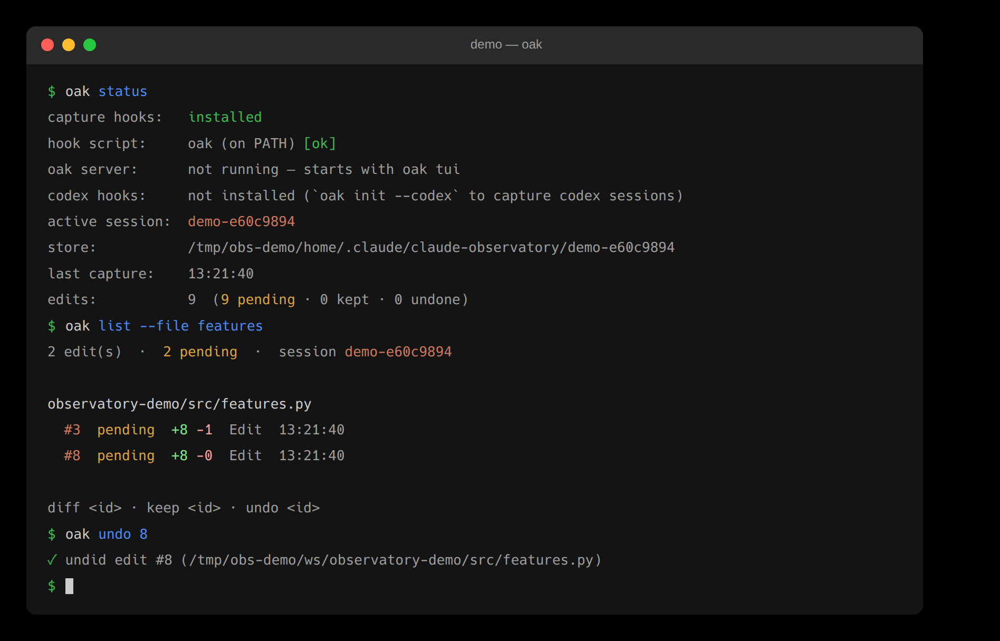

# OAK

Standalone, git-free, **per-edit Keep / Undo for [Claude Code](https://claude.com/claude-code)** on established and mission-critical codebases — a running list of every file change Claude makes, each with surgical undo. Works in the terminal and (with the companion extensions) the VS Code sidebar and JetBrains IDEs. Capture runs in local hooks, so it costs **zero extra Claude tokens**. Its `--json` output is the view API behind the editors' panels — including the 0.8.0 **real-time multi-agent** surfaces: the master–detail Overview (a fleet of running agents across git **worktrees** — correlated git-free — plus workflow runs) and the cross-agent task log.



## Install

Install oak, get herdr. The backend is a hard dependency pinned at 0.9.1 in `herdr.lock`;
installation verifies its checksum and preserves newer versions already installed. OAK needs Node.js
20 or newer. On Linux, npm compiles node-pty, the helper the terminal app's herdr tab runs herdr in:
that needs `python3`, `make` and a C++ compiler (`g++`, or whatever `$CXX` names), and npm 12 runs the
build only with `--allow-scripts=node-pty`. Without them the herdr tab cannot start and `oak doctor`
warns; fix what it names, then reinstall OAK (re-run its installer, or
`oak update --cli-only --force`, which take care of it). Meanwhile `oak attach` opens herdr without it.

```bash
# one command — installs the CLI + editor extensions from the latest release, then prompts for hooks
curl -fsSL https://raw.githubusercontent.com/cell-observatory/oak-observatory/main/scripts/bootstrap.sh | bash
```

Or install just the CLI from a [release](https://github.com/cell-observatory/oak-observatory/releases) tarball:

```bash
npm i -g --allow-scripts=node-pty ./oak-observatory-<ver>.tgz   # npm 12 builds node-pty only when allowed
oak doctor --fix             # install the pinned herdr, its integrations and OAK's herdr plugin
oak init --with-statusline   # run with Claude Code CLOSED, then launch it — sessions now capture
```

Until `oak doctor --fix` has installed herdr, the terminal app's herdr tab cannot start it and says
`could not launch <path to herdr> — run oak doctor --fix`.

Update anytime with `oak update` (or re-run the bootstrap).

`--with-statusline` also installs the **bundled** [claude-statusline](https://github.com/cell-observatory/claude-statusline) (no download — it ships inside this package) so the editor sidebars can show 5h/week plan-usage bars. Install/refresh it any time with `oak statusline`.

## Commands

```text
oak doctor --fix        # repair herdr (binary, hooks, missing sidebar widths and gruvbox theme), stale focus servers, and native PTY helper permissions
oak machine add build-box user@host  # provision and register an SSH machine
oak machine list --json
oak conversation --session <id> --json  # read the native transcript: the last 50 TURNS by default
                        # (--limit N counts turns, and `truncated` reports the bytes cut above them);
                        # --since <cursor> returns every record appended after it, and `reset` marks a
                        # replaced transcript — redraw from those events instead of appending them
oak focus --session <id> --tab observatory  # select in an attached TUI
oak status              # hooks + hook-path health + active session + counts
oak sessions            # this machine's sessions by workspace, newest conversation first (● = the one this directory
                        # resolves to); a session in which nothing happened is left out unless it may still be running
oak inbox               # every session waiting on you, most urgent first — permission prompts (with the tool),
                        # questions (with their options), input waits, then finished turns; --next names the one to jump to
oak search <words…>     # every conversation on this machine, ranked: the asks you typed and the answers you got
                        # (every word must appear; a hit in the ask outranks one in the answer); --days N, --limit N, --json
oak notify --watch      # desktop notifications for raised hands from a plain terminal (the editors announce in-process);
                        # --message <text> pops one to check the plumbing — nothing is ever answered for you
oak prompts             # the session as the list of things YOU asked for (--id <n> drills into one; --id <n> --response prints Claude's reply)
oak list [--pending|--kept|--undone] [--file <substr>]
oak diff <id>           # before/after for one edit
oak keep <id>           # keep the whole change edit <id> belongs to (no disk change; --all / --file <substr> for bulk)
oak undo <id> [--force] # surgically undo the whole change edit <id> belongs to (--ids <a,b,c> takes single edits)
oak redo <id> [--force] # re-apply the whole undone change edit <id> belongs to (--ids <a,b,c> takes single edits)
oak task-keep <taskId>  # keep every pending edit in a task's strict in-progress span; --json
oak task-undo <taskId>  # revert every pending edit in that same strict span; --json
oak task-clear <taskId> # drop a task's resolved edits (--completed clears every settled task); --json
oak demo                # simulate a Claude session LIVE through the real pipeline (isolated demo-* session + folder) — review works for real; --fast for scripts; demo --clean removes every trace
oak clean               # GC orphaned blobs + superseded cache files (--resolved [--under <path> | --ids <a,b,c>] | --completed [--stale <Nd>] [--dry-run] | --drop <id> | --older-than 30d | --all)
oak statusline          # install/refresh the bundled status line (needs bash + jq)
oak init --project      # install the hook into a repo's ./.claude/settings.json (for teams)
```

Live agents and conversation drafts (herdr owns agent terminals):

```text
oak comment add|list|rm|compose|send --session <id>  # line comments on a pending edit, batched into ONE prompt
                        # (add --edit <n> [--line <n>] --text "…"; compose prints an unsent draft, send submits it)
oak quote --session <id>   # the agent's last reply as a > block, to quote/annotate in your next prompt
oak server status|start|stop   # local focus endpoint only
```

A **task** is one of Claude Code's own numbered to-dos. `task-keep`, `task-undo`, and `task-clear` act only on the edits captured while that task was in progress. Edits that fall outside every in-progress window stay unassigned; the CLI never sweeps them into a neighboring task.

A **prompt** is one of your own turns. `prompts` lists them in order, each carrying the edits, files, folders, tokens, agents, workflows, tasks, and shells it produced. Attribution goes by start time: a shell a prompt launched stays that prompt's even if it exits during a later one.

**Machine-readable surface** — the view API the editor front-ends build on (the JetBrains plugin entirely); `list`/`status`/`sessions`/`keep`/`undo`/`redo` all take `--json`, plus:

```text
oak multitask --json    # real-time multi-agent view: every running agent across the repo's worktrees — phase · sparkline · ±diff · risk · subagents · workflows · conflicts, git-free
oak tasklog --json      # cross-agent task log: one row per stable taskId, unioned across worktrees + subagents
oak chat-context --json # zero-token, ready-to-paste chat prompt about an action/edit/subagent/task (--tool-use-id | --edit | --agent | --task)
oak changemap           # the Overview view-model: the per-prompt slices + per-file/per-folder churn rollups (per task/subagent/workflow/agent) as JSON
oak views --json        # several read-only views in ONE process: {name: payload}, each byte-identical to its own command (--views a,b,c to pick). One spawn per refresh instead of eight — what the JetBrains plugin drives its whole tick through
oak titles --json       # Remote Control titles read from claude.ai: {enabled, status (ok|auth|no-login|error|never), fetchedAt, attemptedAt, titles (how many are cached), error?, cache (its path)}
                        #   --refresh reads now · --off stops the automatic read and drops the cache · --on resumes it
oak sessions --json    # {active, sessions:[{id, workspace, title, lastActiveMs, lastTurnMs, current, edits, pending, files, added, removed, tokens, durationMs, model, effort}]} — local conversations grouped by workspace, current workspace first; cached counts refresh when the log changes
oak blob <sha>          # raw blob bytes to stdout
oak locate --file <f>   # per-pending-edit line indices in the LIVE buffer (text on stdin; JSON out)
oak observe             # recap + per-edit reasoning/flags/file-memory as JSON
oak usage               # ctx / 5h / week usage snapshot as JSON (incl. staleness metadata)
oak usage --bill-day 10 # anchor month figures to your bill cycle (Anthropic bills on the
                        #   signup anniversary; run once per machine, 0 clears)
oak usage --breakdown   # tokens + ~$ by week/month/model/session, for claude AND codex
                        #   --by week|month|model|session · --agent claude|codex|both · --weeks N
                        #   ~$ are API list prices — compute-value estimates, not a bill
```

`undo/redo --json` return the structured result (`{ok, status, message}`) so callers can branch `conflict` → offer `--force` instead of parsing prose.

If the store stays busy for 10 s after an undo or redo has changed the files, the result names the edits whose status was not recorded and the `oak undo|redo --ids … --record-only` command that records them without touching a file (`unrecorded: {ids, commands, message}` in `--json`).

**Opt-in `claude -p` analysis** (spends tokens; returns the cached result unless `--fresh`):

```text
oak analyze <id>        # deep-analyze one edit     [--json --fresh --claude-bin <path>]
oak recap               # one-line session recap    [--json --fresh --claude-bin <path>]
oak suggest             # next steps + suggestions  [--json --fresh --claude-bin <path>]
```

Surgical undo reverts a single edit while preserving later edits to the same file (a position-anchored 3-way merge); genuine overlaps become a clear conflict with a per-file restore fallback.

See the full feature tour — plus the VS Code / JetBrains extensions and the full design — in the [main README](../../README.md#the-observatory).

## Agents and machines

`oak tui` opens herdr · Observatory · Review (Observatory · Review when it runs inside a herdr pane). herdr owns agent terminals; Observatory reads their
native conversations and captures edits through the existing hooks and transcript pipeline.
Use `oak doctor --fix` for the pinned herdr setup, `oak agent start --kind claude|codex` to start an
agent, and `oak machine add <label> <ssh-target>` / `oak machine list` for machines.

`oak comment compose --session <id>` and `oak quote --session <id>` produce drafts.
`oak comment send`, `oak quote --send`, or `oak prompt --session <id> --text "…"` explicitly submit
through core to a live pane. `--json` reports `sent`; a failed or unavailable send keeps a clipboard
and printable draft. Comments are marked sent only after acknowledgement.

`oak server start|stop|status` manages the local focus endpoint only. Use
`oak focus --session <id> --tab observatory|review|herdr` to select a conversation in an attached TUI.
The `remotes` command and its SSH session scanner are retired: OAK reads a saved machine by running that
machine's own `oak` over SSH (`--machine`). Usage is measured on each machine for itself. See
[remote setup](../../docs/REMOTE.md).
